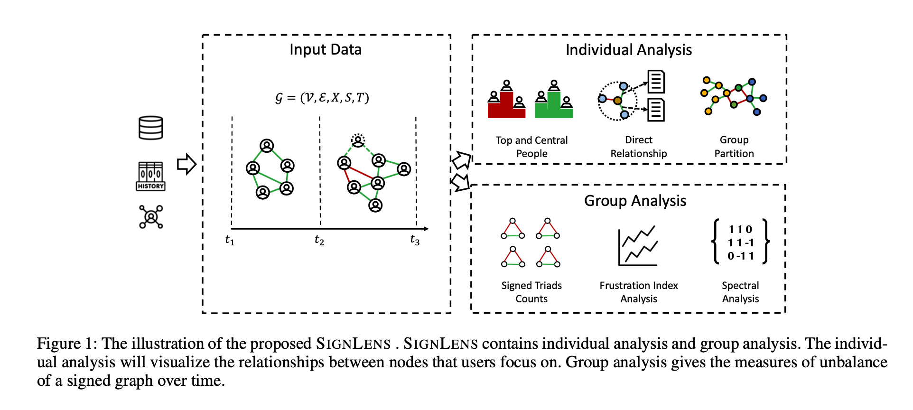
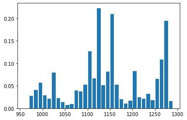
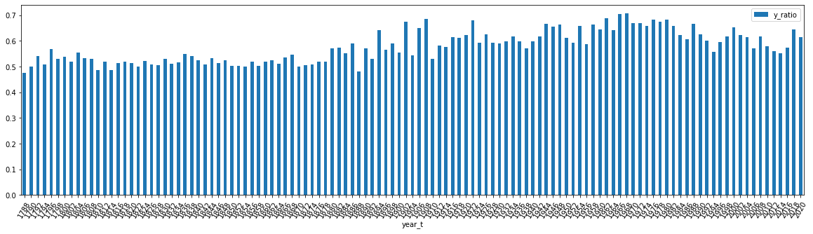
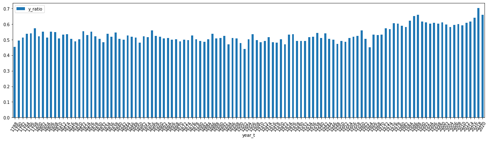

========
SIGNLENS
========

.. image:: https://img.shields.io/travis/huangjunjie-cs/sign_lens.svg
        :target: https://travis-ci.org/huangjunjie-cs/sign_lens

.. image:: https://img.shields.io/pypi/v/sign_lens.svg
        :target: https://pypi.python.org/pypi/sign_lens

SIGNLENS is a tool that helps to analyze polarized social relationships based on signed graph modeling.

It also include a Python package for signed graph modeling.

System Design
=============

Individual Analysis
-------------------

For individual analysis, we usually focus on some specific nodes. 

Group Analysis
--------------
For group analysis, we analyze it with time.

Data Collection
---------------

We give two examples from real-world applications to demonstrate how our system works. 

Here is the `cleaned data link <./datas/readme.md>`_

The China Biographical Database (CBDB)
--------------------------------------

The data is collected from `CBDB <https://projects.iq.harvard.edu/cbdb>`_

Run the spider by:

.. code-block:: python

    python get_cbdb_data.py

United States Congress Vote (UCSV)
----------------------------------

The data is collected from `GovTrack.us <https://www.govtrack.us/>`_

Run the spider by:

.. code-block:: python

    python get_govtrack_data.py

Data Analysis
==============

CBDB
----

For CBDB dataset, you can follow `this jupyter notebook <./ipynbs/cbdb_analysis.ipynb>`_

USCV
----

For USCV dataset, you can follow `this jupyter notebook <./ipynbs/uscv_analysis.ipynb>`_

Developments
============

This system is a web based system but also include a Python Package \ :literal:`sign_lens`\.
This `readme <./development.md>`_ will help you to run it.

Some codes will be updated after the busy weeks. Sorry for the delay! 

Cite
----

Please cite `our paper <https://ojs.aaai.org/index.php/ICWSM/article/view/18136`_  if you use these codes and datasets in your own work:

.. code-block:: bash
 
    @inproceedings{huang2021signlens,
      title={SIGNLENS: A Tool for Analyzing People's Polarization Social Relationship Based on Signed Graph Modeling},
      author={Huang, Junjie and Shen, Huawei and Cheng, Xueqi},
      booktitle={Proceedings of the International AAAI Conference on Web and Social Media},
      volume={15},
      pages={1091--1093},
      year={2021}
    }

Feel free to `email us <mailto:huangjunjie17s@ict.ac.cn>`_ if you wish to improve this project

