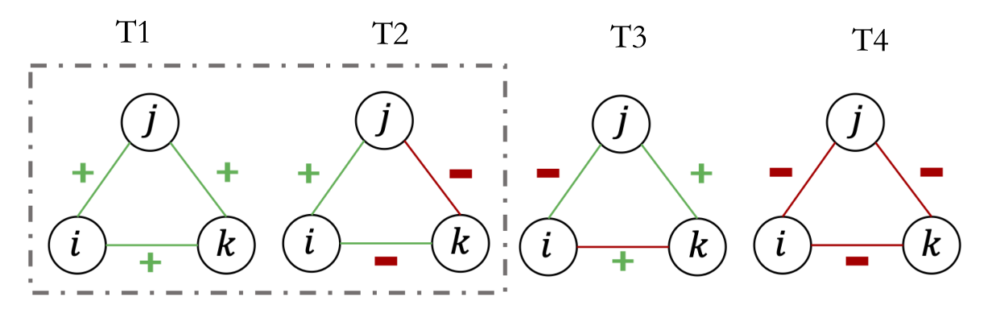
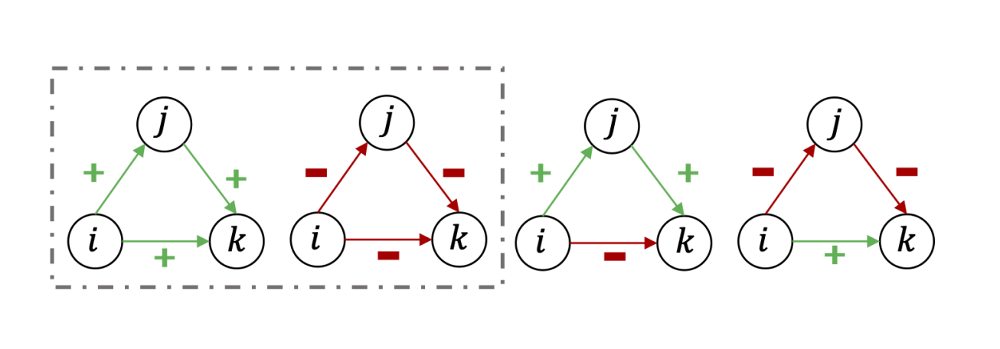
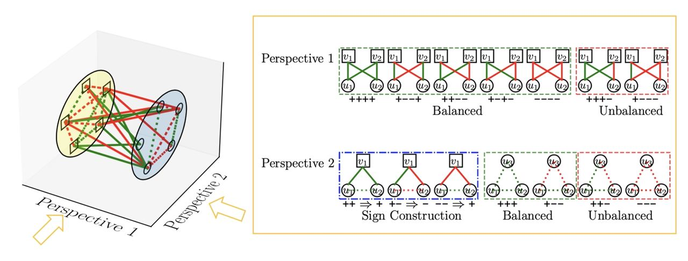

Preliminary for Signed Networks
===============================

.. |pos| raw:: html

    positive

.. |neg| raw:: html

    negative

What is signed networks?
------------------------

Signed networks are such social networks having both |pos| and |neg| links.
The |pos| links usually indicate |pos| emotions such as *like* and *trust*.
The |neg| links indicate |neg| attitudes including *dislike* and *distrust*.
Signed networks can be used to study a variety of social phenomena, such as mining polarized social relationships in social media.
A lot of theories and algorithms have been developed to model such networks (e.g., balance theory and status theory).

Signed Directed Networks
-------------------------

A signed directed network :math:`\mathcal{G}=(\mathcal{V}, \mathcal{E}, s)` , where :math:`\mathcal{V}` is the set of nodes in a graph :math:`\mathcal{G}`, and :math:`\mathcal{E}` is the edges with signs and directions.
:math:`\mathcal{E}` consist of :math:`\mathcal{E}^{+}` and :math:`\mathcal{E}^{-}` while :math:`\mathcal{E}^{+} \bigcap \mathcal{E}^{-}=\emptyset` ; :math:`\mathcal{E}^{+}` and :math:`\mathcal{E}^{-}` denoted the sets of |pos| and |neg| links, respectively. 

It can be denoted as the adjacency matrix of the signed network :math:`A`, where :math:`A_{i j}=1` means there exists a |pos| link from :math:`u_{i}` to :math:`u_{j}, A_{i j}=-1` denotes a |neg| link from :math:`u_{i}` to :math:`u_{j}`, and :math:`A_{i j}=0` means there is no link from :math:`u_{i}` to :math:`u_{j}`. 
According to the above definition, it can be seen that :math:`A` is not necessarily a symmetric matrix.
This matrix can be split into 4 different matrices 

.. math::

    A = A^{+} + A^{-} = A_1^{+} + A_2^{+} - A_3^{-} - A_4^{-}

where :math:`A_2^+ = {A_1^+}^T` and :math:`A_3^- = {A_4^-}^T`.

For such signed directed networks, two theories (i.e., **structural balance theory** and **status theory**) provide a plausible explanation for the structure and dynamics of the observed networks :cite:p:`leskovec2010signed,huang2021sdgnn` .

Balance Theory
***********************

    Illustration of balance theory

The structural balance theory is originated in social psychology in the mid-20th-century. It considers the possible ways in which triangles on three individuals can be signed (see :numref:`balance-theory`), and posits that triangles with three |pos| signs (T1) and those with one |pos| sign (T2) are more plausible (balanced) — and hence should be more prevalent in real networks — than triangles with two |pos| signs (T3) or none (T4). 

Balanced triangles with three |pos| edges exemplify the principle that **“the friend of my friend is my friend”**, whereas those with one |pos| and two |neg| edges capture the notions that **“the friend of my enemy is my enemy”**, **“the enemy of my friend is my enemy”**, and **“the enemy of my enemy is my friend”**. 

Status Theory
***********************

    
    Illustration of status theory

Balance theory can be viewed as a model of likes and dislikes. 
However, as :cite:t:`guha2004propagation` observe in the context of Epinions, a signed link from A to B can have more than one possible interpretation, depending on A’s intention in creating the link. 

In particular, a |pos| link from A may mean, “B is my friend,” but it also may mean, “I think B has higher status than I do.” 
Similarly, a |neg| link from A to B may mean “B is my enemy” or “I think B has lower status than I do.”

We consider a |pos| directed link to indicate that the creator of the link views the recipient as having higher status; 
and a |neg| directed link indicates that the recipient is viewed as having lower status. 
For the triangles in :numref:`status-thoery` , the first two triads satisfy the status order, but the last two do not satisfy it. For the first triads, when Status(j) > Status(i) and Status(k) > Status(j), we have Status(k) > Status(i).

Comparison of Balance and Status
****************************************

Balance theory was initially intended as a model for undirected networks, although it has been commonly applied to directed networks by simply disregarding the directions of the links :cite:p:`leskovec2010signed`. 

:cite:t:`leskovec2010signed` find that significant alignment between the observed network data and Davis’s notion of weak structural balance.

.. note::
    
    Triangles with exactly two |pos| edges are massively underrepresented in the data relative to chance, while triangles with three |pos| edges are massively overrepresented.
    In two of the three datasets, triangles with three |neg| edges are also overrepresented, which is at odds with Heider’s formulation of balance theory. 

These two theories can be  analyzed somewhat by counting the number of triangles.

:cite:t:`huang2021sdgnn` find that only a tiny fraction of triangles satisfies neither of two theories. About 70% of triads can be consistent with both theories. 

Signed Triangle
***********************

Following :cite:t:`chen2018bridge`, we can have following possible types of triads for :math:`\triangle{ijk}` when  we consider both direction and sign.

.. plot:: plots/triangle.py
    :align: center
    :caption: Signed triangles in signed directed networks.
    

For these signed triangles, some of the triangles above satisfy balance theory (i.e., "+++", "++-") and some satisfy status theory (Status(j) > Status(i) and Status(k) > Status(j), we have Status(k) > Status(i)).
Some triangles will make contradictory predictions based on two theories. 
:cite:t:`chen2018bridge` further examine the percentage of triads satisfying balance and/or status theory on large scale online social networks.

On one hand, we can count it by computing the intersection of neighboring nodes or using
matrix operations.
By multiplying these matrices, we can count the number of signed triangular structures below.
For example, the first triangle with a |pos| link from i to j can be computed by

.. math::

    {A_1^+} \cdot {A_1^+} \odot (1 - I)\odot {A_1^+},

where :math:`\cdot` is the matrices product, and :math:`\odot` is the Hadamard product, :math:`\odot (1 - I)` is used to remove self_loop.

For the ``python`` code, you have following operations:

.. code-block:: python

    import scipy.sparse
    A_1_plus = scipy.sparse.csr_matrix([[0, 1, 1], 
                                        [0, 0, 1], 
                                        [0, 0, 0]])
    res = A_1_plus.dot(A_1_plus)
    res.setdiag(0)
    res = res.multiply(A_1_plus) 
 
    print(res.sum()) # result 1

Signed Bipartite Networks
-------------------------

A signed bipartite network :math:`\mathcal{G}=(\mathcal{U}, \mathcal{V}, \mathcal{E})`, where :math:`\mathcal{U}=\left\{u_{1}, u_{2}, \ldots, u_{|\mathcal{U}|}\right\}` and :math:`\mathcal{V}=\left\{v_{1}, v_{2}, \ldots, v_{|\mathcal{V}|}\right\}` represent two sets of nodes with the number of nodes :math:`|\mathcal{U}|` and :math:`|\mathcal{V}| . \mathcal{E} \subset \mathcal{U} \times \mathcal{V}` is the edges between :math:`\mathcal{U}` and :math:`\mathcal{V}`. :math:`\mathcal{E}=\mathcal{E}^{+} \bigcup \mathcal{E}^{-}` is the set of edges between the two sets of nodes :math:`\mathcal{U}` and :math:`\mathcal{V}` where :math:`\mathcal{E}^{+} \cap \mathcal{E}^{-}=\varnothing`, :math:`\mathcal{E}^{+}` and :math:`\mathcal{E}^{-}` represent the sets of |pos| and |neg| edges, respectively.

Since it is a social network, we assume that :math:`\mathcal{U}` represents user nodes and :math:`\mathcal{V}` represents item nodes.
:numref:`application-sbn` shows some common application scenarios for signed bipartite networks, including product review, bill vote, and peer review.

    Common application scenarios for signed bipartite networks.

Some opinions can be viewed as |pos| relationships, such as favorable reviews on products, supporting the bill, accepting a paper, and so on. Meanwhile, some opinions are |neg| links that indicate |neg| reviews, disapproving a bill, rejecting a paper, and so forth. These scenarios can be modeled as signed bipartite networks, which include two sets of nodes (i.e., :math:`\mathcal{U}` and :math:`\mathcal{V}`) and the links with |pos| and |neg| relationships between two sets.

Signed Caterpillars and Signed Butterflies
*********************************************

    
    For a signed bipartite network, there exist two different analysis perspectives. 

The “butterfly” is the most basic motif that models cohesion in an unsigned bipartite network, which is the complete 2×2 biclique. 
Based on the butterfly definition, :cite:t:`derr2019balance` extends it to the signed butterfly by giving signs to the links in classical butterfly isomorphism. 
Except for signed butterfly definition, :cite:t:`derr2019balance` denote "signed caterpillars" as paths of length that are missing just one link to becoming a signed butterfly. They use signed butterflies to investigate balance theory in signed bipartite networks.

For signed bipartite networks, the nodes of the same set are not connected.
Therefore, :cite:t:`huang2021signed`  proposed a new sign construction process by judging the sign of the link from :math:`\mathcal{U}` to :math:`\mathcal{V}`.

As shown in Perspective 2 in :numref:`sbn-cikm2021`, when :math:`u_1` and :math:`u_2` have links with same sign on :math:`v_1` (i.e., :math:`u_1\rightarrow^{+} v_1, u_2\rightarrow^{+} v_1` or :math:`u_1\rightarrow^{-} v_1, u_2\rightarrow^{-} v_1`), we construct a positive links between :math:`u_1` and :math:`u_2` (i.e., :math:`\texttt{+}\texttt{+}\Rightarrow \texttt{+}` and :math:`\texttt{-}\texttt{-}\Rightarrow \texttt{+}`).
When :math:`u_1` and :math:`u_2` have different link signs on :math:`v_1` (i.e.,, :math:`u_1\rightarrow^{+} v_1, u_2\rightarrow^{-} v_1`,), we construct a negative links between :math:`u_1` and :math:`u_2` (i.e., :math:`\texttt{+}\texttt{-}\Rightarrow \texttt{-}`).
Since :math:`\mathcal{U}` is a set of people nodes (\eg Buyer, Congress, and Reviewer), the positive and negative links can be regard as agreement and disagreements.
For :math:`\mathcal{V}`, the positive link can be viewed as similarity and vice versa.
After constructing the sign links between nodes of the same types, we can use the balance theory analysis in the classical signed networks.
So when we analyze the signed bipartite networks, we can have two different analysis perspectives in :numref:`sbn-cikm2021`.

Similarly, we can compute the number of signed Butterflies by computing the intersection of neighboring nodes or using matrix operations. For example, if we want to count the value of first butterfly (i.e., )

References
-------------------------

.. bibliography::
